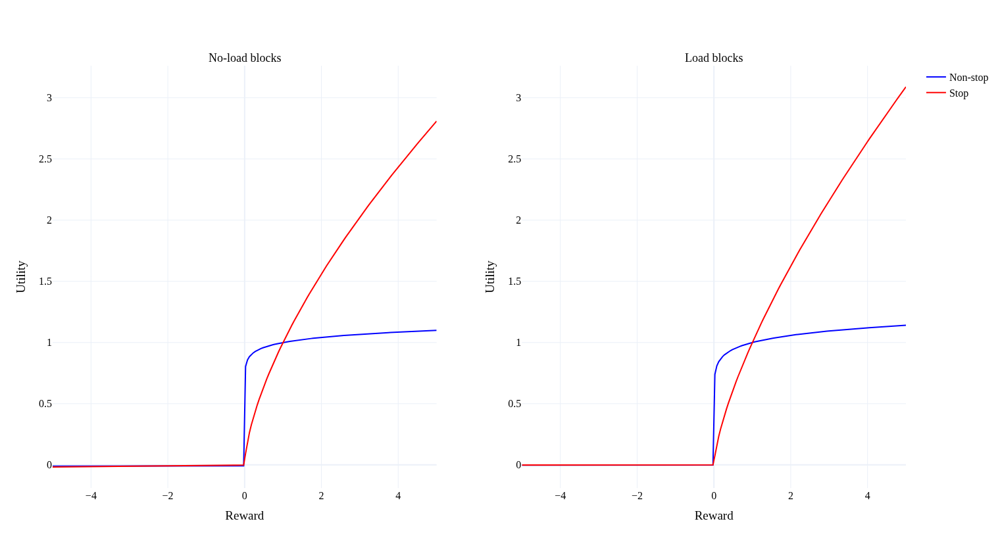
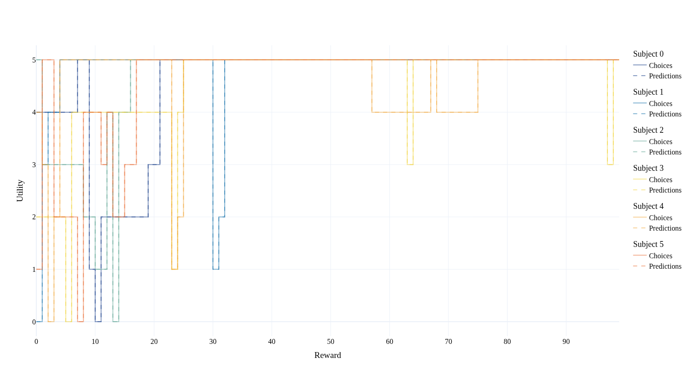
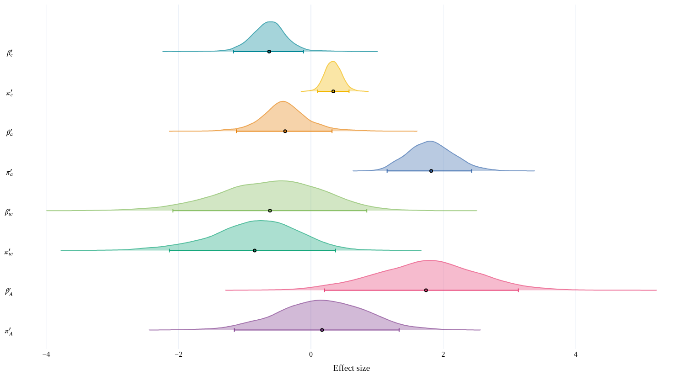

# decision-making-exam
Our exam project for decision making on the Cognitive Science Master programme at Aarhus University

## How to use the model?

In order to use the model that we used for our experiments, use the `pvl_delta` module in this repository.
It contains a NumPyro-compatible PVL model.

### Installation

Clone github repo and install requirements:

```
git clone https://github.com/x-tabdeveloping/decision-making-exam.git
cd decision-making-exam
pip install -r requirements.txt
```

### Sample the prior

Make a new file in this folder to be able to import from the module.
Load the model then sample prior:

```python
import numpy as np
import jax
from numpyro.infer import Predictive

from pvl_delta import pvl_delta_model

rng_key = jax.random.key(42)
prior = Predictive(
    pvl_delta_model,
    num_samples=1000,
)
key, subkey = jax.random.split(key)
n_subjects = 4
n_arms = 4
# Indicates whether each subject belonged to the stop condition group or not
stop_condition = np.array([False, True, True, False])
prior_sample = prior(
    subkey,
    # You have to specify that this is for prior sampling,
    # otherwise you have to give the choices and rewards as well,
    # since the prior predictive depends on it
    prior=True,
    n_arms=n_arms,
    n_subjects=n_subjects,
    stop_condition=stop_condition,
)
prior_mean = {key: np.mean(value) for key, value in prior_sample.items()}
```

### Sampling the posterior

You can fit the model to experimental data that you have.
This will require that you arrange choices and rewards to the proper format:

```python
import arviz as az
from numpyro.infer import NUTS, MCMC
from numpyro.infer.reparam import LocScaleReparam

# Shape: (n_trials, n_subjects)
# Each entry is the chosen arm
choices = np.array([
  [0, 0, 2, 1],
  [2, 1, 0, 1],
  ...
])
# Shape: (n_trials, n_subjects)
# Each entry is the reward the subject received for choosing the arm
rewards = np.array([
  [0.5, 0.0, 1.0, 0.25],
  [0.0, 0.25, 0.5, 0.25],
  ...
])
# Indicates whether each subject was presented with a load block or not on a given trial
# Shape: (n_trials, n_subjects)
load_blocks = np.array(
  [
    [True, True, False, False],
    [False, False, True, True],
    ...
  ]
)
# The posterior is very hard to sample so we increase the target acceptance probability
# to 0.9 from 0.8 to avoid having too many divergences
inference_key = jax.random.key(0)
# We reparametrize to avoid the Funnel of Hell
config = {
    "probit_lr": LocScaleReparam(centered=0),
    "probit_inv_t": LocScaleReparam(centered=0),
    "probit_u_shape": LocScaleReparam(centered=0),
    "probit_u_aversion": LocScaleReparam(centered=0),
}
reparam_model = numpyro.handlers.reparam(pvl_delta_model, config=config)
# We bump max_tree_depth and target_accept_prob from their default values to help the sampler
nuts_kernel = NUTS(reparam_model, target_accept_prob=0.9, max_tree_depth=15)
mcmc = MCMC(nuts_kernel, num_samples=1000, num_warmup=3000, num_chains=4)
key, subkey = jax.random.split(key)
mcmc.run(
    inference_key,
    choices=choices,
    rewards=rewards,
    load_blocks=load_blocks,
    stop_condition=stop_condition,
    n_arms=n_arms,
    n_subjects=n_subjects,
)

# Prints summary over sampling statistics and parameter estimates:
mcmc.print_summary()

# Converts sampling data to ArViz compatible InferenceData object
idata = az.from_numpyro(mcmc)
```

Consult [ArViz's](https://python.arviz.org/en/stable/index.html) manual and [Xarray's](https://docs.xarray.dev/en/stable/) documentation on how to use InferenceData.

### Sampling posterior predictive

You can use NumPyro to get posterior predictive estimates for subjects' choices.

```python
predictive = Predictive(reparam_model, mcmc.get_samples())
ppc_key = jax.random.key(0)
posterior_predictive = predictive(
    ppc_key,
    choices=choices,
    rewards=rewards,
    stop_condition=stop_condition,
    n_arms=n_arms,
    n_subjects=n_subjects,
)
# Adding data to InferenceData object so you can use it in ArViz
idata.extend(az.from_numpyro(posterior_predictive=posterior_predictive))
```

### Recovering subjects' estimates of expected values

Subjects, throughout the experiment keep track of their latent estimate of the expected value of each arm/deck.
You can get an estimate of these expected values at each time point during the experiment by using the `trace_q` function on parameter estimates.
In this example I will use the posterior mean as a point estimate.

```python
from pvl_delta import trace_qs

# Taking the mean over each chain and draw from the posterior
mean_posterior = idata.posterior.mean(dim=["chain", "draw"])

# shape: (n_trials, n_subjects, n_arms)
# Each entry q_pred[i, j, k] contains the expected value for arm k for subject j at trial i
q_pred = trace_qs(
    c=choices,
    r=rewards,
    # Initial estimate of expected values. Here we set them to zero
    q0s=np.zeros((n_subjects, n_arms)),
    learning_rates=mean_posterior["lr"].values,
    u_aversion=mean_posterior["u_aversion"].values,
    u_shape=mean_posterior["u_shape"].values,
)
```

## Visualization 

The `pvl_delta.plots` module contains a number of figures you can easily produce once having fit the model:

You can plot the mean utility function using `plot_utilities` for conditions and blocks:
```python
from pvl_delta.plots import plot_utilities

plot_utilities(idata, load_blocks, stop_condition)
```



You can plot true choices vs predicted ones using `plot_choices``:
```python
from pvl_delta.plots import plot_choices

plot_choices(idata, choices)
```



You can investigate effects by using `plot_effects`:

```python
from pvl_delta.plots import plot_effects

plot_effects(idata)
```



